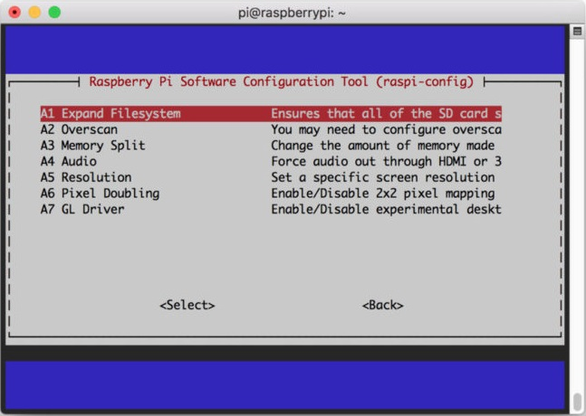
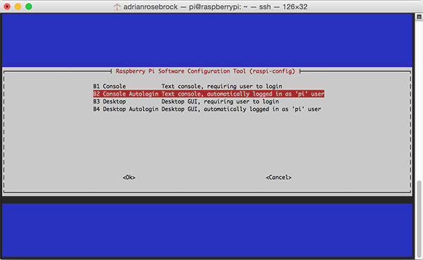
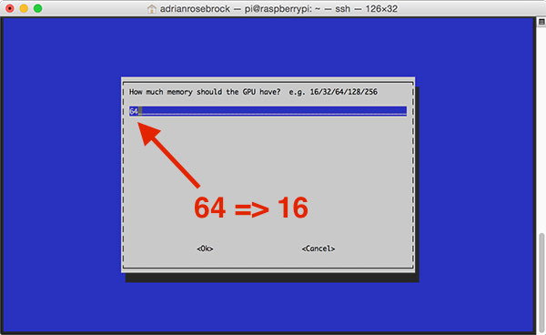

**UPDATE: Adicionei o processo fácil de instalação. Veja abaixo em [INSTALAÇÃO SIMPLES](#instalação-simples).**

# Introdução

Assim como muita gente, tive problemas para instalar o OpenCV e a bilioteca Dlib pra trabalhar com visão computacional no Raspberry Pi.

Exatamente por isso decidir ajudar, dei uma bela lida nos tutoriais disponíveis e documentação oficial e resolvi compartilhar este processo com alguns scripts pra facilitar e a automatizar bastante esta instalação, deixando quase fácil.

Testei com algumas versões diferentes (de hardware e software) com sucesso. Mas, obviamente não consegui cobrir todos os cenários, então sinta-se a vontade para colaborar com um Pull Request ou me avisar.

O que tem nesse tutorial está (em inglês) no meu github: https://github.com/alexandremendoncaalvaro/install-opencv-dlib-raspbian

# Recomendações (para projetos de visão computacional com Raspberry Pi)
Raspberry Pi 3 ou acima
SD Card classe 10 com 16GB ou mais
Módulo de Câmera do Raspberry Pi ¹
Raspbian Buster ou acima
Você pode usar diretamente o terminal do Raspbian ou conectar por SSH.
Não pule nenhuma etapa deste tutorial!

>¹Ao contrário de uma webcam USB, o módulo de câmera se liga diretamente a GPU.

# Instalação do Raspbian
Não passe trabalho desnecessariamente, utilize a ferramenta oficial pra gravar o Raspbian no cartão SD. 😊

[Raspberry Pi Imager for Windows](https://downloads.raspberrypi.org/imager/imager.exe)  
[Raspberry Pi Imager for macOS](https://downloads.raspberrypi.org/imager/imager.dmg)  
[Raspberry Pi Imager for Ubuntu](https://downloads.raspberrypi.org/imager/imager_amd64.deb)  


# INSTALAÇÃO SIMPLES

1) Preparando o sistema pra dar conta da instalação.  
**IMPORTANTE:** Navegue até a pasta do seu projeto pelo terminal (se precisar crie uma), então rode: 

```bash
/bin/bash -c "$(curl -fsSL https://raw.githubusercontent.com/alexandremendoncaalvaro/install-opencv-dlib-raspbian/master/easy-install.sh)"
```
>Ao final irá reiniciar para interface de linha de comando

2) Execute o comando:

```bash
~/install-opencv-dlib-raspbian/easy-install-after-reboot.sh
```

>Ao final irá reiniciar para interface desktop

*Faça exercícios, tome um banho, tire uma soneca… Pois vai demorar algumas horas..


## Testando

Para o OpenCV rode no terminal:

```bash
~/install-opencv-dlib-raspbian/test-opencv.sh
```

Para o DLIB rode no terminal:
```bash
~/install-opencv-dlib-raspbian/test-dlib.sh
```

e então:

```bash
cd ~/install-opencv-dlib-raspbian && python ~/install-opencv-dlib-raspbian/test-dlib.py
```

# INSTALAÇÃO PASSO A PASSO

Eu sugiro que siga pela [instalação simples](#instalação-simples) (UPDATE). Mas se quiser especificar versões das bibliotecas use estas instruções.

# Compilando o OpenCV no Raspbian
Rode cada uma destas linhas no Terminal do Raspbian:

```bash
git clone https://github.com/alexandremendoncaalvaro/install-opencv-dlib-raspbian.git ~/install-opencv-dlib-raspbian && cd ~/install-opencv-dlib-raspbian
```

```bash
chmod +x ~/install-opencv-dlib-raspbian/*.sh
```

```bash
~/install-opencv-dlib-raspbian/swapfile.sh
```

# Preparando o sistema pra dar conta da instalação

```bash
sudo raspi-config
```

e então selecione Advanced Options => Expand filesystem:



Na tela inicial do raspi-config vá em Boot Options => Desktop / CLI => Console Autologin:




Novamente na tela inicial do raspi-config vá em Advanced Options => Memory Split, onde você vê 64MB (ou outro valor):



Atualize este valor para 16MB e finalize o raspi-config.

Ao sair será solicitado para reiniciar.

Vá em frente, Reinicie!

## Depois do reboot

volte ao terminal do Raspbian:

```bash
~/install-opencv-dlib-raspbian/install.sh
```
>Isto vai instalar o OpenCV 4.3.0, para outras versões insira o número ao final do comando, conforme exemplo:  
~/install-opencv-dlib-raspbian/install.sh 4.1.1

*Faça exercícios, tome um banho, tire uma soneca… Pois vai demorar algumas horas..


# Instalando a Dlib no Raspbian
IMPORTANTE: Navegue até a pasta do seu projeto pelo terminal (se precisar crie uma) e rode estes comandos:
```bash
pipenv install && pipenv shell
```

```bash
pipenv install 'numpy==1.18.4' 'dlib==19.19.0'
```

>Pra outras versões altere no comando ou simplesmente remova para utilizar a última versão:
pipenv install numpy dlib

*Pegue um café, vai demorar bem menos que o outro, mas vai demorar.


Para linkar a instalação do OpenCV com o python no seu projeto, rode este comando:

```bash
~/install-opencv-dlib-raspbian/link-virtualenv.sh
```

# Finalizando
No terminal do Raspbian:

```bash
~/install-opencv-dlib-raspbian/swapfile.sh 100
```

IMPORTANTE: Volte as configurações originais de Memory split e o Boot pra interface Desktop seguindo o processo que usamos o raspi-config.

# Testando

Para o OpenCV rode no terminal:

```bash
~/install-opencv-dlib-raspbian/test-opencv.sh
```

Para o DLIB rode no terminal:
```bash
~/install-opencv-dlib-raspbian/test-dlib.sh
```

e então:

```bash
cd ~/install-opencv-dlib-raspbian && python ~/install-opencv-dlib-raspbian/test-dlib.py
```

# Referências
https://www.pyimagesearch.com/2017/05/01/install-dlib-raspberry-pi/

https://www.pyimagesearch.com/2018/01/22/install-dlib-easy-complete-guide/

https://www.pyimagesearch.com/2019/09/16/install-opencv-4-on-raspberry-pi-4-and-raspbian-buster/

https://www.pyimagesearch.com/2018/09/26/install-opencv-4-on-your-raspberry-pi/

https://www.youtube.com/watch?v=uF4aDdxBm_M

https://gist.github.com/chirag773/b4c94b5bb4b2e7fcac0d21680c5d4492

https://gist.github.com/willprice/abe456f5f74aa95d7e0bb81d5a710b60